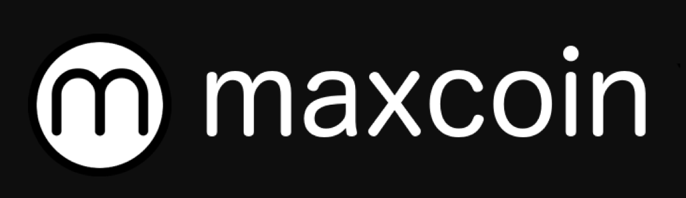
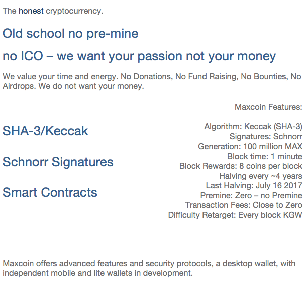

Maxcoin: Open Source - Community Developed

Maxcoin Mission

Interdependence and decentralisation 

We aim to unleash the full potential of a limited supply, decentralised, sustainable, quantum resistant digital currency.
Solar miners & wind turbine nodes, smart contract governance voting system, Decentralised exchange integration, free blockchain courseware material and educational partnerships along with a growing list of merchants.

Maxcoin in the Community

Power to the Maxcoin User

By matching Maxcoin’s core values and principles to those of the communities, we have created a growing, nurturing and sustainable environment for every cryptocurrency user, speculator and contributor. Just as Community contribution of time, resources and culture are invaluable to any start-up industry, organisation or society, these contributions play a much greater role at Maxcoin as there is no central bank/funding system to reward the contributors. The motivation for contribution in an open source project should not be purely for financial reasons, but of giving back to the community.
We invite you to take action, contribute and not wait to be invited.
Maxcoin is your coin, whether you’ve been with us since day 1 or just discovered us today.  Maxcoin is in your hands, the early adopters, miners, developers and enthusiasts to promote Maxcoin with a goal for worldwide adoption.

Maxcoin Merchants/Commerce

With fast and secure transactions and close to 0 transaction fees benefiting both merchants and users, Maxcoin is poised for a unique position in the cryptocurrency space.  We are now integrating with existing open source projects and 3rd party providers of payment and merchant services, to create accessible and reliable forms of payments to merchants and users alike. Become a Maxcoin merchant by integrating Maxcoin payments thru a payment gateway and be listed on our merchants page.
Cryptocurrency Organic Vs In-Organic Growth

Why organic growth?


We believe that when a cryptocurrency is allowed to grow organically thru effective management and planning and via developers instead of marketers & financiers it can remain loyal to the core mission. The success of Maxcoin will be thru skilful execution and integration, and not via a quick money grab or funding scheme. Although, the advantages of inorganic growth can be immediate in the cryptocurrency world, we must not forget that that is the world we are escaping.  

Why NOT in-organic growth?


Firstly, Maxcoin has no funds to support in-organic growth, just humans with a desire to contribute to the network. Secondly, the world of mergers, acquisitions, joint ventures and market share, things that are prevalent in the ICO/token industrial complex should not be a keystone of a cryptocurrency. It is accelerated growth based on a promise to the community, ultimately falling short of expectations, a house of cards. 
