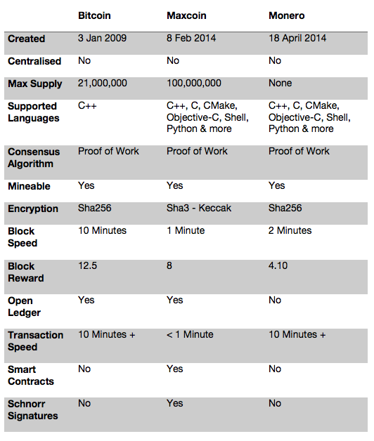

Maxcoin: Open Source - Community Developed

Maxcoin Mission

Interdependence and decentralisation 

We aim to unleash the full potential of a limited supply, decentralised, sustainable, quantum resistant digital currency.
Solar miners & wind turbine nodes, smart contract governance voting system, Decentralised exchange integration, free blockchain courseware material and educational partnerships along with a growing list of merchants.

Maxcoin in the Community

Power to the Maxcoin User

By matching Maxcoin’s core values and principles to those of the communities, we have created a growing, nurturing and sustainable environment for every cryptocurrency user, speculator and contributor. Just as Community contribution of time, resources and culture are invaluable to any start-up industry, organisation or society, these contributions play a much greater role at Maxcoin as there is no central bank/funding system to reward the contributors. The motivation for contribution in an open source project should not be purely for financial reasons, but of giving back to the community.
We invite you to take action, contribute and not wait to be invited.
Maxcoin is your coin, whether you’ve been with us since day 1 or just discovered us today.  Maxcoin is in your hands, the early adopters, miners, developers and enthusiasts to promote Maxcoin with a goal for worldwide adoption.

Maxcoin Merchants/Commerce

With fast and secure transactions and close to 0 transaction fees benefiting both merchants and users, Maxcoin is poised for a unique position in the cryptocurrency space.  We are now integrating with existing open source projects and 3rd party providers of payment and merchant services, to create accessible and reliable forms of payments to merchants and users alike. Become a Maxcoin merchant by integrating Maxcoin payments thru a payment gateway and be listed on our merchants page.
Cryptocurrency Organic Vs In-Organic Growth

Why organic growth?


We believe that when a cryptocurrency is allowed to grow organically thru effective management and planning and via developers instead of marketers & financiers it can remain loyal to the core mission. The success of Maxcoin will be thru skilful execution and integration, and not via a quick money grab or funding scheme. Although, the advantages of inorganic growth can be immediate in the cryptocurrency world, we must not forget that that is the world we are escaping.  

Why NOT in-organic growth?


Firstly, Maxcoin has no funds to support in-organic growth, just humans with a desire to contribute to the network. Secondly, the world of mergers, acquisitions, joint ventures and market share, things that are prevalent in the ICO/token industrial complex should not be a keystone of a cryptocurrency. It is accelerated growth based on a promise to the community, ultimately falling short of expectations, a house of cards. 

Coin Comparison

The 3 Cryptocurrencies which cover all aspects and capabilities that would be needed to be filled for a digital currency are listed and compared below:

How to Buy Maxcoin

1. Yobit

After you have created and verified your Yobit account, you will need to fund your account to buy Maxcoin.
Head over to the ‘Wallets’ page, where you directly transfer your Bitcoins/Satoshis into your YoBit.Net account, a wide range of altcoins are also supported which you can deposit, sell for Bitcoin/Satoshi and then use to buy Maxcoin.

Direct USD transfer is also available by clicking the + beside USD and following the on screen instructions.
After your account is funded head over to this link (https://yobit.net/en/trade/MAX/BTC) or search for MAX in the ‘Markets’ page.

2. Cryptohub

Cryptohub.online follows a similar process, once you have created and verified your account, you will need to fund your account to buy Maxcoin. Click Menu and navigate to ‘Profile/Balances'.

Once you find Bitcoin in the list (usually top) select ‘Deposit’ under operations, you will then be asked to generate a wallet address.

Please note the minimum deposit is listed at 0.00500000 BTC (correct at time of writing)
After, head to ‘Marketplace’ and search for MAX from the dropdown list, or visit this link (https://cryptohub.online/market/MAX/)
Once here, you will be able to see the price live and view/create an order.

3. BoaExchange

Create an account on https://www.boaexchange.com/ and fund your account in the wallets section. Maxcoin is available for purchase using either Bitcoin, Ethereum or Bitcoin Cash. Then head to the Exchange tab and search.

Can I mine Maxcoin?

Absolutely!
For a full list of supported mining software, here
For list of available pools, here
For the latest information and updates,  as well as all the information mentioned here, please visit the official website at https://www.maxcoinproject.org

How to Store Maxcoin – Wallets

Maxcoin has over 4 years of blockchain to sync using the Maxcoin QT wallet which can normally take up to a week to sync due to a lack of volunteer developers who can help rebase to a single block head thread sync.
If you would like to sync faster than normal consider the following options.
Bootstrap = 3 days
Torrent = 1 day ( Link only works if Torrent Client Installed )
In Progress (light wallet & iOS & Android wallets. iOS Preview on YouTube ) = seconds
If you are having trouble with your Maxcoin wallet, reach out to us on telegram.

Desktop Wallets are currently available on Windows, MacOS and Linux, as well as a ‘paper wallet’ which is downloadable and runs by launching the html file.

https://maxcoinproject.org/#wallets

Call to Arms

We would also like to invite anyone who wishes to bring coding knowledge to the project to join our community. As a community project we depend on people who are interested in the project to actively participate to enable its success.

All input big or small is used to help shape the emerging culture that is arising within the community around the project, in line with our philosophy and organic growth structure.
